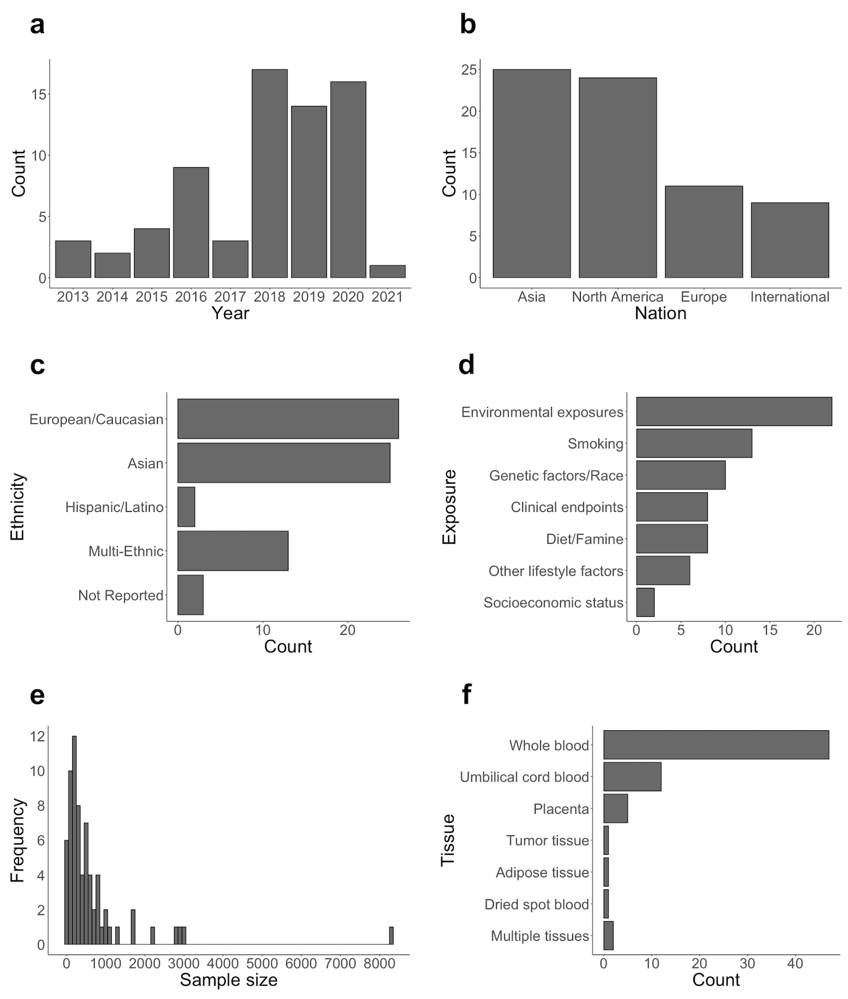

## 1. Introduction
Drs. Ryosuke Fujii from Fujita Health University and Shuntaro Sato from Nagasaki University Hospital conducted a scoping review for mediation analysis applying for DNA methylation. This scoping review published in *Epigenetics*, 12 August 2021. The motivation was to provide a primer of mediation analysis for DNA methylation dataset. Hence, the essence of methodological aspect is also incorporated in this scoping review.

### Link for our paper ([**Link**](https://doi.org/10.1080/15592294.2021.1959736))

## 2. Mediation analysis
The motivation of statistical mediation analysis is to evaluate whether an intermediate variable is on the pathway between the exposure of interest on an outcome. In mediation analysis, the total effect, which is the effect of exposure on the outcome, is decomposed into direct and indirect effects. A **direct effect** is the effect of exposure on an outcome in causal paths without mediators. An **indirect effect** is the effect of exposure on an outcome in causal paths through mediators. Considering a quantitative decomposition of effects, this methodology is matched by statistical analysis methods to estimate the mediated effects of DNAm. This section consists of the following three parts:

1. we will introduce several mediation approaches and their characteristics;
2. we will describe the effects estimated by mediation analysis in the context of DNAm; 
3. we will summarize mediation analysis with potential pitfalls.


## 3. Short summary for review part
### Background
DNA methylation (DNAm) is one of the most studied epigenetic modifications. DNAm has emerged as a key biological mechanism and biomarkers to test associations between environmental exposure and outcomes in epidemiological studies. Although previous studies have focused on associations between DNAm and either exposure/outcomes (**Fig a**), it is useful to test for mediation of the association between exposure and outcome by DNAm (**Fig b**).

```{r fig.cap = "Conceptual figure of epidemiological studies for DNA methylation a) without mediation analysis and b) with mediation analysis.", echo = F, layout = "l-body-outset", fig.width=6, fig.height=1.5}
knitr::include_graphics("images/Figure1.jpg")
```


### Study Aim
This scoping reveiw aimed 1) to introduce the essence of mediation analysis and 2) to review the study applying mediation analysis for DNA methylation data.

### Method
Based on published peer-reviewed journals using four online databases (PubMed, Scopus, Cochrane, and CINAHL) in December 2020. Of 219 extracted articles by initial screening, a total of 69 articles were eligible for this review.

### Result & Discussion
The breakdown of reviewed papers was 13 for smoking (18.8%), 8 for dietary intake and famine (11.6%), 6 for other lifestyle factors (8.7%), 8 for clinical endpoints (11.6%), 22 for environmental chemical exposures (31.9%), 2 for socioeconomic status (SES) (2.9%), and 10 for genetic factors and race (14.5%) (**Fig d**).

```{r fig.cap = "Graphical information for the reviewed articles. a: Published year; b: Countries; c: Ethnicities; d: Exposures; e: Sample sizes; f Tissues.", out.extra = "class=external", echo = F, layout = "l-body-outset", fig.width = 6, fig.height = 6}

```

We found heterogenous methods and interpretations in mediation analysis with typical issues such as different cell compositions and tissue-specificity.

### Conclusion
Further accumulation of evidence with diverse exposures, populations and with rigorous methodology will be expected to provide further insight in the role of DNAm in disease susceptibility.

## 4. Acknowledgment
We are grateful to Drs. Ryuji Uozumi and Shinjo Yada (Kyoto University) for their comments on this manuscript.