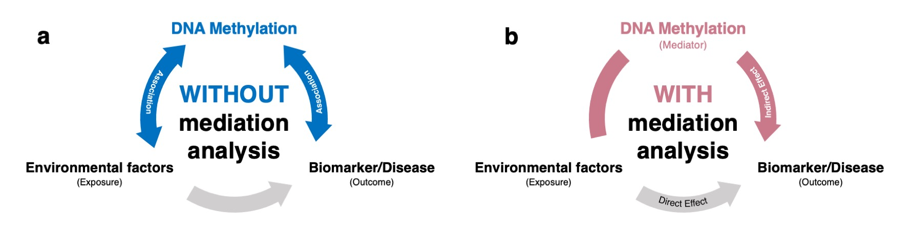

## 1. はじめに
藤田医科大学医療科学部の藤井亮輔、長崎大学病院臨床研究センターの佐藤俊太朗らはDNAのメチル化を媒介変数とする媒介分析を活用した疫学研究のレビューを行いました。この論文では、分子疫学研究における媒介分析の実践に向けたPrimerとなるようなレビューを心がけ、方法論の解説も合わせて執筆しました。
このページ自体は、論文の内容（執筆の動機や媒介分析のエッセンス、レビューの結果）を解説するページです。

### 論文のURLは[**こちら**](https://doi.org/10.1080/15592294.2021.1959736)です。

## 2. 論文のサマリー
### 背景
DNAメチル化（DNAm）は、最も研究されているエピジェネティックな修飾^[DNA配列を変更せずに、遺伝子の役割を制御する後天的なゲノム修飾のこと]の一つです。DNAmは、疫学研究において、環境への曝露（X）と転帰（Y）との関連性を検証するための重要なメカニズムであり、バイオマーカーでもあります。これまでの研究ではDNAmと曝露・転帰のいずれかとの関連性に焦点が当てられてきましたが（**下図a**）、DNAmによる曝露と転帰の関連性の媒介を検討することは有用です（**下図b**）。

```{r fig.cap = "Conceptual figure of epidemiological studies for DNA methylation a) without mediation analysis and b) with mediation analysis.", echo = F, layout = "l-body-outset", fig.width=6, fig.height=1.5}

```


### 目的
このスコーピング・レビューでは、1）媒介分析の方法論的本質を紹介すること、２）媒介分析を適用した新しい疫学研究の結果をレビューすることを目的としました。

### 方法
2020年12月に4つのオンラインデータベース（PubMed、Scopus、Cochrane、CINAHL）から219件の論文を抽出し、69件が本レビューの対象となりました。

### 結果と考察
レビューした論文のうち、曝露要因の内訳は、喫煙が13件（18.8％）、食事摂取と飢餓が8件（11.6％）、その他のライフスタイル要因が6件（8.7％）、臨床エンドポイントが8件（11.6％）、環境化学物質曝露が22件（31.9％）、社会経済的地位（SES）が2件（2.9％）、遺伝要因と人種が10件（14.5％）でした。

DNAメチル化の解析では、細胞組成の違いや組織特異性などの典型的な問題があり、また、媒介分析についても手法や解釈が不均一であることがわかりました。

### 結論
今後は、多様な曝露要因、異なる集団、厳密な手法の適用による研究を積み重ねることで、曝露-結果のパスウェイにおけるDNAmの役割についてさらなるエビデンスが構築されることが期待されます。


## 3. 謝辞
京都大学大学院医学研究科・魚住龍史講師および矢田真城助教からは、本原稿に関するご助言を頂きました。この場を借りて深く感謝を示します。

## 4. English link
English summary is available [**HERE**](https://shuntaros.github.io/mediation-analysis-DNA-methylation/English.html)