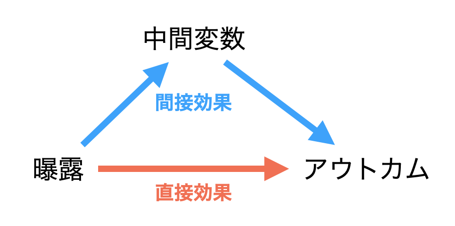
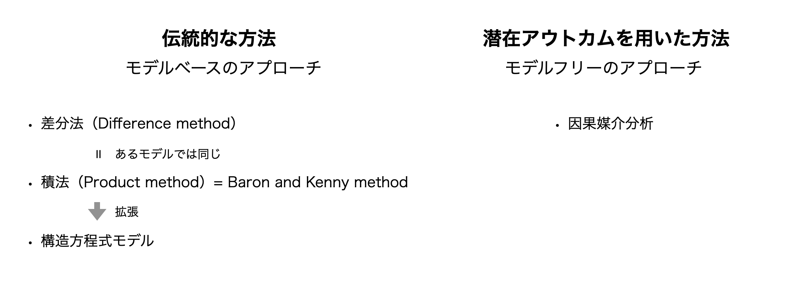
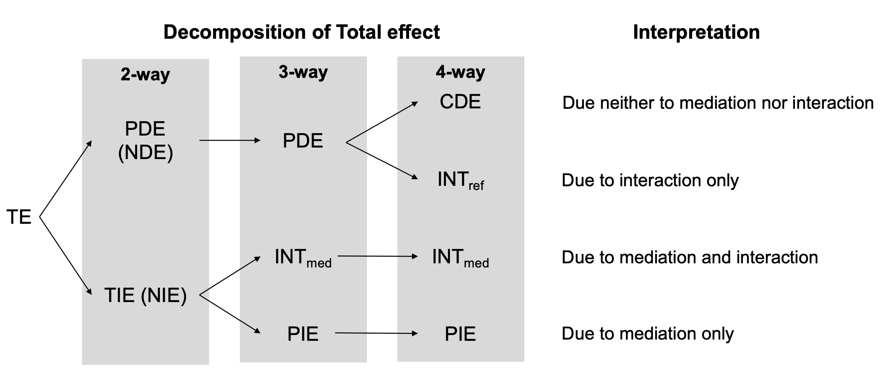

## 媒介分析とは
**媒介分析**は、興味のある曝露とアウトカムの間の経路上に中間変数があるかどうか評価する方法です。一般的な因果推論では、この中間変数を除いて曝露とアウトカムとの関連を推定します。ここで得られた関連の程度を平均因果効果といいますが、媒介分析の文脈では**総合効果（Total effect）**といいます。媒介分析ではこの総合効果を**直接効果（Direct effect）**と**間接効果（Indirect effect）**に分解します（**図1**）。

本節は、3つの部分から構成されます。

1. いくつかの媒介分析の方法とそれらの特徴の紹介
2. DNAmの文脈における因果媒介分析で推定される効果の説明
3. 潜在的な落とし穴

```{r fig.cap = "媒介分析における効果の分解", echo = F, fig.align = "center"}

```

### 1. 媒介分析の方法
媒介分析は、伝統的な方法と潜在アウトカムを用いた方法（因果媒介分析）に分類されます。伝統的な方法には、差分法（Difference method）、積法（Product method）、構造方程式モデル（Structual equation model: SEM）が含まれます。^[Robins JM, Greenland S. Identifiability and exchangeability for direct and indirect effects. Epidemiology. 1992;3:143–55.] ^[Pearl J. Direct and Indirect Effects. Proceedings of the Seventeenth Conference on Uncertainty and Artificial Intelligence. 2013;411–20.]。これらの手法の関係と特徴を**図2**に示します。

```{r fig.cap = "媒介分析の方法", echo = F, fig.align = "center", layout = "l-body-outset"}

```

伝統的な方法は、**モデルベース**のアプローチです ^[Nguyen TQ, Schmid I, Stuart EA. Clarifying causal mediation analysis for the applied researcher: Defining effects based on what we want to learn. Psychol Methods [Internet]. 2020 Jul 16; Available from: http://dx.doi.org/10.1037/met0000299]。曝露、アウトカム、中間変数との関係をパラメトリックモデルで表し、推定される回帰係数を用いて直接効果と間接効果を計算します。積法はBaron and Kennyの方法と言われることもあります。また、あるモデルにおいて差分法と積法から計算できる効果は同じになります ^[Timothy L Lash, Tyler J VanderWeele, Sebastien Haneuse, Kenneth J Rothman. Modern Epidemiology, 4th edition. Wolters Kluwer; 2021.]。

SEMは積法を発展させた方法です。柔軟なモデリングで多くの変数間の関係を調べることができ、近年は非線形性や交互作用も扱うこともできます。ただし、これらの方法で推定される効果は、モデルによって表記が異なります。そのため、統一的に表現することが難しいです。

因果媒介分析は、**モデルフリー**のアプローチです。潜在的な（反事実的な）アウトカムを用いた効果を拡張させたフレームワークです。このフレームワークは、研究課題を解決するための推定値を得るためのプロセスを3つに分けます。

1. Estimandの決定
2. 推定値から効果を識別する条件を明らかにする
3. 推定

次の項で、このプロセスを説明しました。

### 2. 因果媒介分析で推定される効果の説明

因果媒介分析のフレームワークでは、潜在的アウトカムフレームワークを用いて効果を定義します。伝統的な方法と同じ、直接効果と間接効果の2つの分解（これを2-way decompositionといいます。）だけではなく、さらに3つと4つの分解（それぞれ、3-way/4-way decompositionといいます。）が提案されています ^[VanderWeele TJ. A three-way decomposition of a total effect into direct, indirect, and interactive effects. Epidemiology. 2013;24:224–32.] ^[VanderWeele TJ. A unification of mediation and interaction: a 4-way decomposition. Epidemiology. 2014;25:749–61.]。論文では、Fasaneliらの例を用いて、これらの分解と解釈を説明しました ^[Fasanelli F, Baglietto L, Ponzi E, Guida F, Campanella G, Johansson M, et al. Hypomethylation of smoking-related genes is associated with future lung cancer in four prospective cohorts. Nat Commun. 2015;6:10192.]。

RQが「媒介効果はあるのか？　その効果はどの程度か？」という問いであるとき、直接効果と間接効果の2つに総合効果を分解するのが一般的な方法です。因果媒介分析では、それぞれを**自然直接効果（NDE: Natural direct effect）**と**自然間接効果（NIE: Natural Indirect effect）**と定義します。この自然直接効果を**純粋直接効果（PDE: Pure direct effect）**ともいいます。

さらに、曝露と中間変数の間に交互作用があると考えることができます。このとき、総合効果は3つまたは4つに分解することができます。**制御された直接効果（CDE: Controlled direct effect）**、**参照交互作用（INTref: Reference interaction）**、**媒介交互作用（INTmed: Mediated interaction）**、**純粋間接効果（PIE: Pure indirect effect）**です ^[これらの分解用の解釈や数式の理解には、『ロスマンの疫学』が参考になります。]。これらの関係と簡単な解釈を**図3**に示します。

```{r fig.cap = "効果の関係と解釈", echo = F, fig.align = "center", layout = "l-body-outset"}

```

また、Inoueらは、これらの4つの効果の直感的な解釈を示すためのDAGを提案しました^[Inoue K, Yan Q, Arah OA, Paul K, Walker DI, Jones DP, et al. Air Pollution and Adverse Pregnancy and Birth Outcomes: Mediation Analysis Using Metabolomic Profiles. Current Environmental Health Reports [Internet]. 2020 Aug 8; Available from: https://doi.org/10.1007/s40572-020-00284-3]。

実践的な疫学研究では、効果を計算することが重要です。2021/8/1の時点で、Rは[**mediation package**](https://cran.r-project.org/web/packages/mediation/vignettes/mediation.pdf)と[**CMAverse package**](https://bs1125.github.io/CMAverse/index.html)を用いて効果を計算することができます。SASでは[**CAUSALMEDプロシジャ**](https://support.sas.com/rnd/app/stat/procedures/causalmed.html)で計算が可能です。


### 3. 潜在的な落とし穴

#### (1) 因果効果の識別性の確認
一般的な因果推論と同様に、推定値を効果と解釈するためには識別性の仮定が必要です。特に重要な仮定は条件付き交換可能性です。従来の因果推論は、曝露とアウトカム変数を軸に考えますが、媒介分析では中間変数も加わります。そのため仮定はより厳しくなります。この仮定を評価するための感度分析がいくつか提案されています　^[Imai K, Keele L, Tingley D, Yamamoto T. Unpacking the Black Box of Causality: Learning about Causal Mechanisms from Experimental and Observational Studies. Am Polit Sci Rev. 2011;105:765–89.] ^[VanderWeele TJ. Bias formulas for sensitivity analysis for direct and indirect effects. Epidemiology. 2010;21:540–51.]。

#### (2) 総合効果を直接効果と間接効果の2つに分解する場合、媒介交互作用はどちらの効果に含めるか？

RQが「媒介効果があるか？」である場合、媒介交互作用は純粋間接効果と組み合わせるのが好ましいようです。一方、RQが「媒介効果に加えて、直接効果があるか？」である場合は、媒介効果は純粋直接効果と組み合わせるのが好ましいようです。

#### (3) 論文にモデルを明記しよう
媒介分析に用いたモデルを論文に明記することは、読者は分解や解釈が適切かどうか検討するに役立ちます。